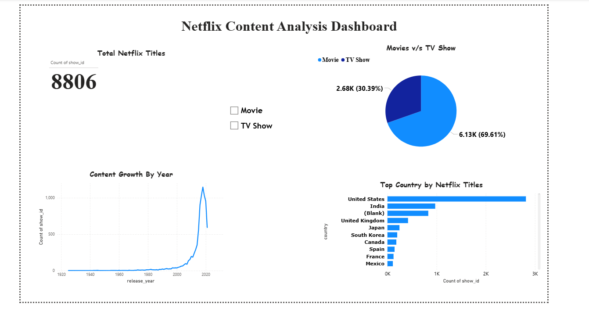

# Netflix Content Analysis Dashboard (Power BI)

## Overview

This project analyzes Netflix content data using Power BI to understand trends in movies and TV shows.

## Dashboard Insights

* Total number of Netflix titles
* Distribution of Movies vs TV Shows
* Growth of Netflix content by release year
* Top countries producing Netflix content
* Interactive filter for Movie and TV Show

## Tools Used

* Power BI
* Data Visualization
* Data Analysis

## Author

Balasurya Yadama

